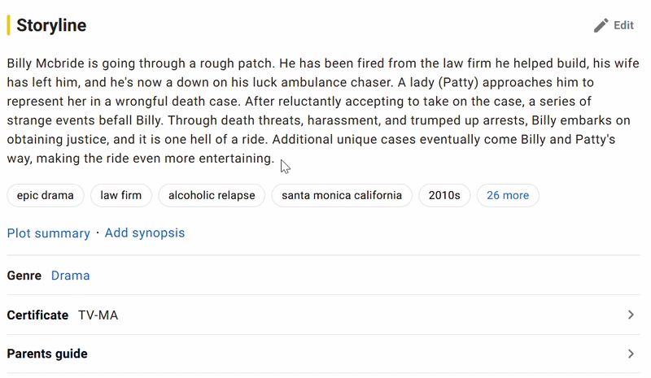

# WordSource

WordSource is a lightweight browser extension that instantly reveals the linguistic origin of English words directly on any webpage.

Highlight a word and see whether it comes from Germanic, Latin, French, Greek, or other language families—without leaving the page.

## Demo

## Features

- 🔍 Instant etymology lookup by highlighting text
- ⌨️ Keyboard shortcut support (`Ctrl + Q`)
- 🌐 Works across most websites
- 📝 Google Docs support via clipboard fallback
- ⚡ Fast local lookups with no external API calls
- 🎯 Minimal, unobtrusive tooltip interface

## Usage

### Mouse Lookup

Highlight any word on a webpage and WordSource will automatically display its linguistic origin.

### Keyboard Lookup

1. Highlight a word or phrase
2. Press `Ctrl + Q`
3. View the origin information instantly

## Information Displayed

Depending on the word, WordSource may show:

- **Origin Category** (Germanic, Latinate, Greek, etc.)
- **Base Form / Lemma**
- **Source Language**
- **Additional etymological details**

## How It Works

WordSource uses a local etymology dataset bundled with the extension. When a word is selected, the extension:

1. Normalizes the selected text
2. Attempts to identify its base form
3. Searches the local dataset
4. Displays the matching etymological information in a tooltip

All lookups are performed locally for speed and privacy.

## Privacy

WordSource does not send highlighted words to external servers. Lookups are performed using data packaged with the extension.

## Limitations

- Not every English word has an available origin entry
- Some words may return **Unknown**
- Highly inflected or uncommon word forms may not resolve correctly
- Google Docs requires copied text (`Ctrl + C`) before lookup due to browser restrictions

## Installation

### From Source

1. Clone this repository
2. Open your browser's extensions page
3. Enable **Developer Mode**
4. Choose **Load Unpacked**
5. Select the project folder

## Data Source

WordSource uses etymology data derived from the open-source **etymology-db** project by David Roher, which extracts and structures information from Wiktionary's etymology sections.

The original dataset can be found at:
https://github.com/droher/etymology-db

Additional processing and lookup logic are implemented within this project to support fast in-browser searches and word normalization.

## Technology

Built with:

- JavaScript (ES Modules)
- Browser Extension APIs
- Local etymology datasets
- Custom word normalization and lookup logic

## Credits

- Etymology dataset derived from the etymology-db project: https://github.com/droher/etymology-db
- Extension icon: Scroll icon by Freepik from Flaticon

## License

See the LICENSE file for details.
